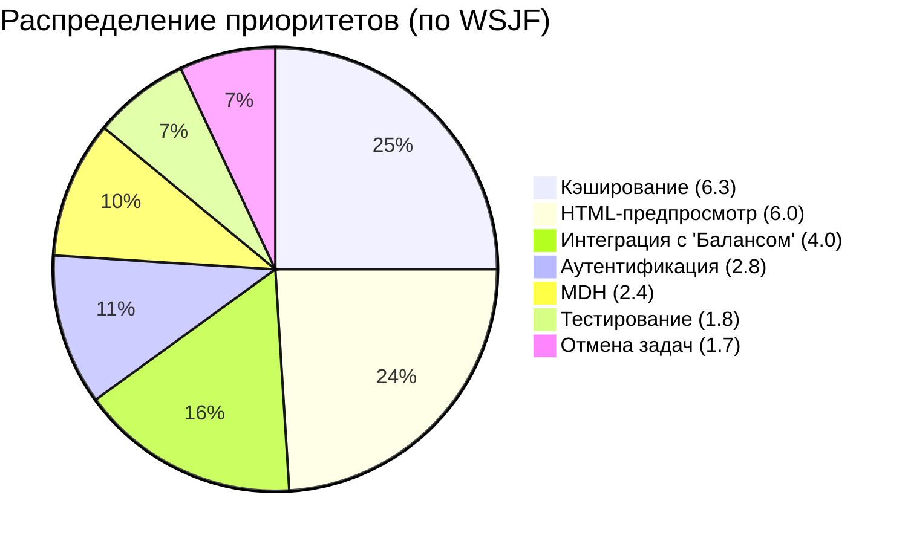

### **Бэклог проекта "Микросервис генерации печатных форм" с приоритизацией по методике WSJF**

---

#### **Критерии оценки**:
1. **Cost of Delay (CoD)**:
   - **User-Business Value** (1-8): Влияние на бизнес-показатели (выручка, клиенты).
   - **Time Criticality** (1-8): Срочность реализации (законодательные изменения, конкуренция).
   - **Risk Reduction** (1-8): Снижение рисков (безопасность, стабильность).
2. **Job Size** (1-13): Трудоемкость в человеко-неделях (ряд Фибоначчи).

---

#### **Список задач и их оценка**:

| Задача                                                      | User-Business Value | Time Criticality | Risk Reduction | **CoD** (сумма) | Job Size | **WSJF** (CoD/Job Size) | Приоритет |
|-------------------------------------------------------------|---------------------|------------------|----------------|------------------|----------|--------------------------|-----------|
| **Интеграция с "Балансом" (генерация счетов)**              | 8                   | 5                | 7              | **20**           | 5        | **4.0**                  | 1         |
| **Реализация кэширования шаблонов (Redis)**                 | 7                   | 6                | 6              | **19**           | 3        | **6.3**                  | 2         |
| **Настройка аутентификации через JWT**                       | 6                   | 8                | 8              | **22**           | 8        | **2.8**                  | 4         |
| **Добавление формата HTML для предпросмотра**               | 5                   | 4                | 3              | **12**           | 2        | **6.0**                  | 3         |
| **Интеграция с MDH (данные подписантов)**                    | 4                   | 3                | 5              | **12**           | 5        | **2.4**                  | 5         |
| **Нагрузочное тестирование (1000 PDF/мин)**                  | 3                   | 2                | 4              | **9**            | 5        | **1.8**                  | 6         |
| **Реализация механизма отмены задач**                        | 2                   | 1                | 2              | **5**            | 3        | **1.7**                  | 7         |

---

#### **Приоритизированный бэклог**:
1. **Реализация кэширования шаблонов (Redis)**  
   - **WSJF**: 6.3  
   - **Обоснование**: Высокая бизнес-ценность (ускорение генерации) + низкие трудозатраты.  
   - **Срок**: 3 недели.

2. **Добавление формата HTML для предпросмотра**  
   - **WSJF**: 6.0  
   - **Обоснование**: Улучшение UX для клиентов с минимальными затратами.  
   - **Срок**: 2 недели.

3. **Интеграция с "Балансом" (генерация счетов)**  
   - **WSJF**: 4.0  
   - **Обоснование**: Критично для запуска MVP, но требует больше ресурсов.  
   - **Срок**: 5 недель.

4. **Настройка аутентификации через JWT**  
   - **WSJF**: 2.8  
   - **Обоснование**: Важно для безопасности, но менее срочно.  
   - **Срок**: 8 недель.

5. **Интеграция с MDH (данные подписантов)**  
   - **WSJF**: 2.4  
   - **Обоснование**: Необходима для полной функциональности, но может быть отложена.  
   - **Срок**: 5 недель.

6. **Нагрузочное тестирование**  
   - **WSJF**: 1.8  
   - **Обоснование**: Проводится после основных интеграций.  
   - **Срок**: 5 недель.

7. **Механизм отмены задач**  
   - **WSJF**: 1.7  
   - **Обоснование**: Удобство, но низкий приоритет на старте.  
   - **Срок**: 3 недели.

---

#### **Комментарии**:
- **Методология**: WSJF выбран из-за учета **бизнес-ценности**, **срочности** и **ресурсозатратности**.  
- **Гибкость**: При изменении условий (например, новые требования к безопасности) бэклог можно пересчитать.  
- **Критерии Job Size**: Оценены по ряду Фибоначчи (1, 2, 3, 5, 8, 13).  

---

#### **Визуализация приоритетов**:

**Итог**: Фокус на задачи с высоким WSJF — быстрая отдача при минимальных затратах.
